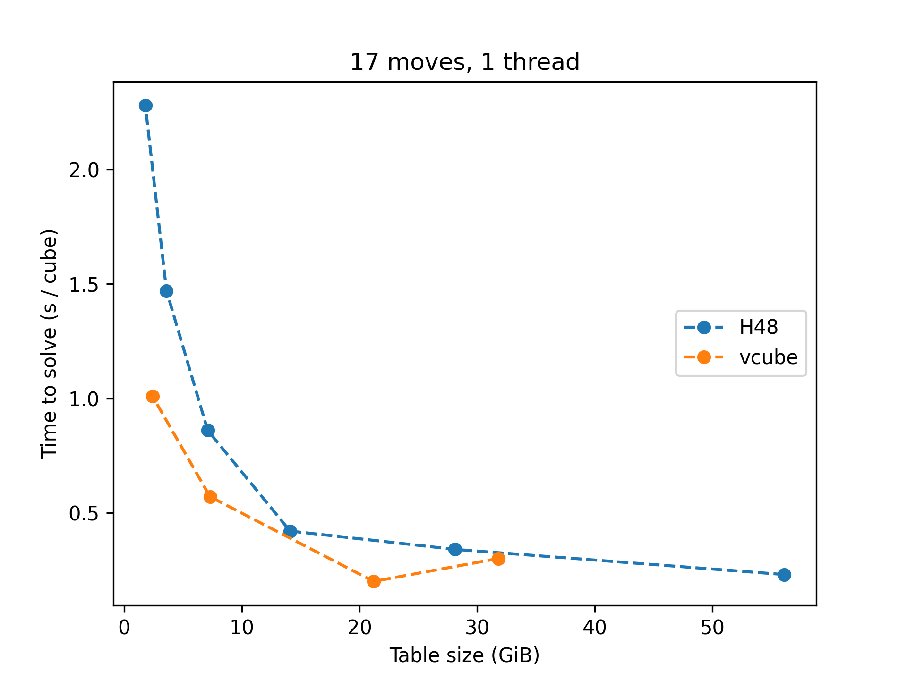
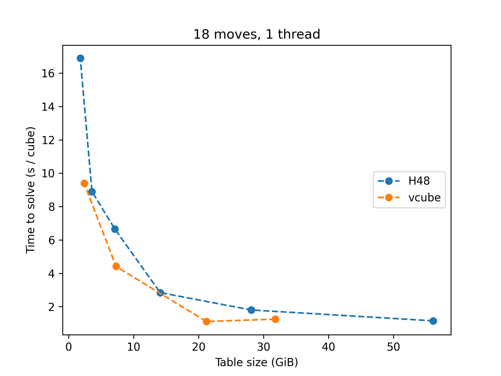
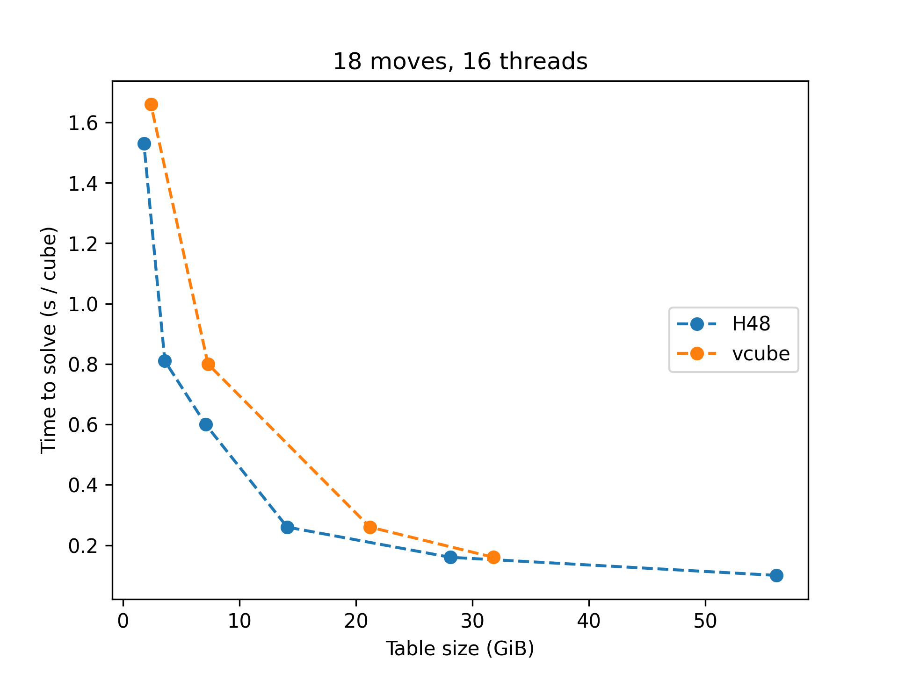
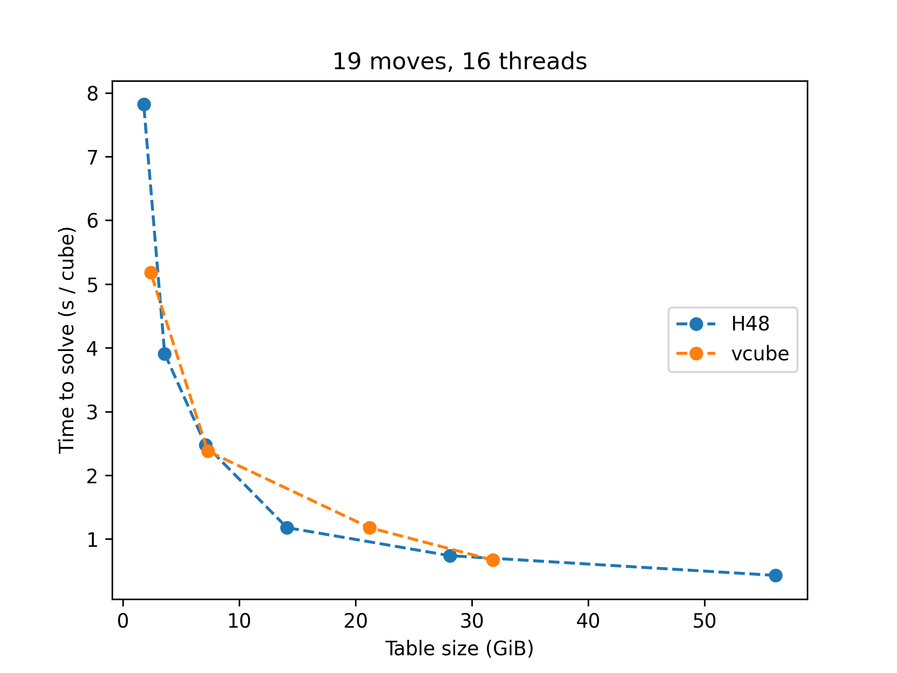
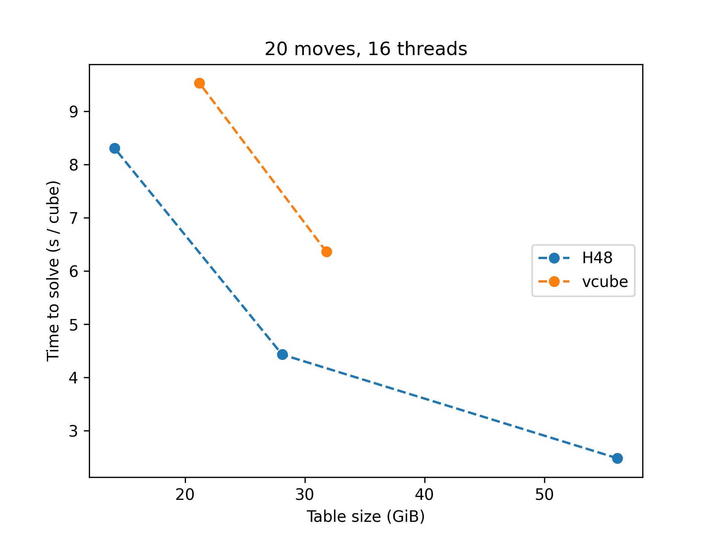

# Benchmarks for the H48 optimal solver and comparison with vcube

This page contains some benchmarks for some of the possible
configurations of the H48 optimal solver. For comparison we also
include similar measurements for Andrew Skalski's impressive optimal
solver [vcube](https://github.com/Voltara/vcube), which has been taken
as a benchmark reference throughout the development of H48. The two
solvers differ both in method (although they both use an A* search)
and implementation.

Similar benchmarks can be found:

* In Chen Shuang's
  [dedicated github page](https://github.com/cs0x7f/cube_solver_test/wiki),
  which includes many more solvers. At the time of writing, the version
  of H48 used for these benchmarks is a rather old one. Note that
  cube48opt is a re-implementation of the H48 solver by Chen Shuang.
* In Enrico Tenuti's [thesis](https://github.com/enricotenuti/h48thesis),
  also using an old implementation of H48, but including more data and
  nice plots.

## Setting

*All movecounts are in Half Turn Metric*

For the benchmarks we used some sets of random positions that can be found
in `benchmarks/scrambles`. We divide them by optimal solution length,
because the time to solve a scramble grows exponentially on the number of
moves, so mixing up positions with long and short solutions is going to
make the shorter solution almost irrelevant. Even within the same solution
length the time to solve a random position can vary significantly,
so we have used sets of 25 scrambles and taken the average of those,
except for the [Superflip](https://en.wikipedia.org/wiki/Superflip),
which is a single scramble.

For short solutions, the very low numbers we get with the largest solver
may be particularly inaccurate, because writing the solution (together
with some log messages) to standard output may take a significant portion
of the time, depending on the terminal emulator used and other factors.

The main test we performed was finding a single optimal solution, and we
compared the results with vcube. This test was run in a single-thread
configuration and in two multithread configurations (with 4 and 16
threads).  We also ran a test on finding *all* optimal solutions which,
as far as I know, is a use case not supported by vcube; this latter test
was only run on 16 threads.

Since the size of the pruning table used by the solver is of utmost
importance, we include two statistics: time per cube and time per cube
*adjusted by table size*.  The adjustment we took simply consists in
multiplying the time per cube by the size of the table. Empirically
this leads to more even results across the board, as the speed of the
solvers of the same family seems to scale linearly with the size of the
pruning table.

All benchmark tests were done on the following configuration:

* CPU: AMD Ryzen 7 7700 (8 cores, 16 virtual threads)
* Memory: 2x Corsair Vengeance 32GB 5600MHz
* Motherboard: Gigabyte B650M K
* Operating system: Debian 13 (Linux kernel 6.12.57)
* Compiler: GCC 14.2.0 for H48 and Clang 19.1.7 for vcube

## Results

Single solution, single thread

Time per cube (in seconds, lower is better).

|  Solver  |  Size  |17 moves|18 moves|19 moves|20 moves|Superflip|
|:---------|:-------|-------:|-------:|-------:|-------:|--------:|
|vcube 212 |58.2 Gib|    0.11|    0.75|    3.43|   27.28|    19.30|
|H48 h11   |56.5 Gib|    0.14|    0.78|    3.74|   26.05|    20.27|
|vcube 404 |31.8 Gib|    0.23|    1.24|    6.10|   59.33|   268.26|
|H48 h10   |28.3 Gib|    0.25|    1.25|    6.33|   44.75|    48.70|
|vcube 308 |21.2 Gib|    0.17|    1.02|    6.20|   58.70|   604.35|
|H48 h9    |14.1 Gib|    0.36|    2.48|   11.73|        |         |
|vcube 208 | 7.3 Gib|    0.56|    4.36|   20.58|        |         |
|H48 h8    | 7.1 Gib|    0.79|    6.07|   25.58|        |         |
|H48 h7    | 3.5 Gib|    1.06|    8.51|   42.97|        |         |
|vcube 112 | 2.4 Gib|    0.96|    9.29|   40.52|        |         |
|H48 h6    | 1.8 Gib|    2.11|   16.23|   81.30|        |         |

Time per cube adjusted for table size (in seconds \* GiB, lower is better).

|  Solver  |  Size  |17 moves|18 moves|19 moves|20 moves|Superflip|
|:---------|:-------|-------:|-------:|-------:|-------:|--------:|
|vcube 212 |58.2 Gib|    6.43|   43.80|  199.38| 1587.43|  1122.73|
|H48 h11   |56.5 Gib|    8.11|   44.29|  211.50| 1471.86|  1145.45|
|vcube 404 |31.8 Gib|    7.40|   39.47|  194.01| 1887.94|  8535.87|
|H48 h10   |28.3 Gib|    7.03|   35.19|  178.96| 1264.32|  1375.96|
|vcube 308 |21.2 Gib|    3.51|   21.71|  131.50| 1245.26| 12819.94|
|H48 h9    |14.1 Gib|    5.09|   35.06|  165.70|        |         |
|vcube 208 | 7.3 Gib|    4.08|   31.74|  149.68|        |         |
|H48 h8    | 7.1 Gib|    5.60|   42.89|  180.75|        |         |
|H48 h7    | 3.5 Gib|    3.74|   30.07|  151.82|        |         |
|vcube 112 | 2.4 Gib|    2.33|   22.53|   98.23|        |         |
|H48 h6    | 1.8 Gib|    3.73|   28.69|  143.70|        |         |

Single solution, 4 threads

Time per cube (in seconds, lower is better).

|  Solver  |  Size  |17 moves|18 moves|19 moves|20 moves|Superflip|
|:---------|:-------|-------:|-------:|-------:|-------:|--------:|
|vcube 212 |58.2 Gib|    0.03|    0.27|    1.04|    7.70|   (a)   |
|H48 h11   |56.5 Gib|    0.05|    0.23|    1.06|    7.07|     6.19|
|vcube 404 |31.8 Gib|    0.07|    0.30|    1.65|   16.17|   (a)   |
|H48 h10   |28.3 Gib|    0.08|    0.37|    1.75|   13.54|    14.26|
|vcube 308 |21.2 Gib|    0.05|    0.35|    1.78|   16.61|   (a)   |
|H48 h9    |14.1 Gib|    0.11|    0.74|    3.37|   24.44|    25.39|
|vcube 208 | 7.3 Gib|    0.16|    1.47|    5.86|        |   (a)   |
|H48 h8    | 7.1 Gib|    0.24|    1.71|    7.22|        |         |
|H48 h7    | 3.5 Gib|    0.31|    2.40|   11.74|        |         |
|vcube 112 | 2.4 Gib|    0.29|    3.13|   11.95|        |   (a)   |
|H48 h6    | 1.8 Gib|    0.61|    4.65|   23.09|        |         |

Time per cube adjusted for table size (in seconds \* GiB, lower is better).

|  Solver  |  Size  |17 moves|18 moves|19 moves|20 moves|Superflip|
|:---------|:-------|-------:|-------:|-------:|-------:|--------:|
|vcube 212 |58.2 Gib|    2.03|   15.69|   60.25|  447.97|   (a)   |
|H48 h11   |56.5 Gib|    2.71|   13.18|   60.13|  399.70|   349.94|
|vcube 404 |31.8 Gib|    2.32|    9.50|   52.46|  514.50|   (a)   |
|H48 h10   |28.3 Gib|    2.17|   10.32|   49.45|  382.53|   402.87|
|vcube 308 |21.2 Gib|    1.02|    7.52|   37.82|  352.36|   (a)   |
|H48 h9    |14.1 Gib|    1.56|   10.45|   47.54|  345.21|   358.74|
|vcube 208 | 7.3 Gib|    1.18|   10.69|   42.63|        |   (a)   |
|H48 h8    | 7.1 Gib|    1.66|   12.08|   50.99|        |         |
|H48 h7    | 3.5 Gib|    1.10|    8.46|   41.48|        |         |
|vcube 112 | 2.4 Gib|    0.69|    7.59|   28.97|        |   (a)   |
|H48 h6    | 1.8 Gib|    1.08|    8.21|   40.82|        |         |

(a) vcube cannot parallelize on a single scramble, the results for the
superflip are going to be the same as in the single thread case.

Single solution, 16 threads

Time per cube (in seconds, lower is better).

|  Solver  |  Size  |17 moves|18 moves|19 moves|20 moves|Superflip|
|:---------|:-------|-------:|-------:|-------:|-------:|--------:|
|vcube 212 |58.2 Gib|    0.02|    0.13|    0.45|    2.84|   (a)   |
|H48 h11   |56.5 Gib|    0.02|    0.08|    0.35|    2.26|     2.49|
|vcube 404 |31.8 Gib|    0.04|    0.14|    0.65|    6.08|   (a)   |
|H48 h10   |28.3 Gib|    0.03|    0.13|    0.60|    4.15|     5.62|
|vcube 308 |21.2 Gib|    0.03|    0.19|    0.78|    6.67|   (a)   |
|H48 h9    |14.1 Gib|    0.04|    0.25|    1.10|    8.04|    10.71|
|vcube 208 | 7.3 Gib|    0.08|    0.79|    2.43|        |   (a)   |
|H48 h8    | 7.1 Gib|    0.08|    0.58|    2.42|        |         |
|H48 h7    | 3.5 Gib|    0.11|    0.80|    3.87|        |         |
|vcube 112 | 2.4 Gib|    0.15|    1.63|    5.10|        |   (a)   |
|H48 h6    | 1.8 Gib|    0.21|    1.51|    7.67|        |         |

Time per cube adjusted for table size (in seconds \* GiB, lower is better).

|  Solver  |  Size  |17 moves|18 moves|19 moves|20 moves|Superflip|
|:---------|:-------|-------:|-------:|-------:|-------:|--------:|
|vcube 212 |58.2 Gib|    0.95|    7.83|   26.04|  165.03|   (a)   |
|H48 h11   |56.5 Gib|    1.17|    4.79|   19.66|  127.55|   140.45|
|vcube 404 |31.8 Gib|    1.21|    4.60|   20.76|  193.43|   (a)   |
|H48 h10   |28.3 Gib|    0.85|    3.62|   16.96|  117.32|   158.83|
|vcube 308 |21.2 Gib|    0.67|    4.01|   16.48|  141.49|   (a)   |
|H48 h9    |14.1 Gib|    0.61|    3.49|   15.57|  113.56|   151.37|
|vcube 208 | 7.3 Gib|    0.56|    5.78|   17.68|        |   (a)   |
|H48 h8    | 7.1 Gib|    0.59|    4.13|   17.07|        |         |
|H48 h7    | 3.5 Gib|    0.40|    2.84|   13.68|        |         |
|vcube 112 | 2.4 Gib|    0.35|    3.95|   12.37|        |   (a)   |
|H48 h6    | 1.8 Gib|    0.38|    2.66|   13.57|        |         |

(a) vcube cannot parallelize on a single scramble, the results for the
superflip are going to be the same as in the single thread case.

All solutions, 16 threads

*Note: vcube does not have an option for finding multiple solutions.*

Time per cube (in seconds, lower is better).

|  Solver  |  Size  |17 moves|18 moves|19 moves|20 moves|Superflip|
|:---------|:-------|-------:|-------:|-------:|-------:|--------:|
|H48 h11   |56.5 Gib|    0.05|    0.42|    3.84|   32.35|    22.63|
|H48 h10   |28.3 Gib|    0.07|    0.72|    6.71|   58.57|    48.90|
|H48 h9    |14.1 Gib|    0.12|    1.28|   12.76|        |         |
|H48 h8    | 7.1 Gib|    0.24|    2.75|   27.44|        |         |
|H48 h7    | 3.5 Gib|    0.36|    4.20|   46.64|        |         |
|H48 h6    | 1.8 Gib|    0.69|    8.15|   91.47|        |         |

Time per cube adjusted for table size (in seconds \* GiB, lower is better).

|  Solver  |  Size  |17 moves|18 moves|19 moves|20 moves|Superflip|
|:---------|:-------|-------:|-------:|-------:|-------:|--------:|
|H48 h11   |56.5 Gib|    2.68|   23.87|  217.09| 1828.13|  1278.88|
|H48 h10   |28.3 Gib|    2.03|   20.22|  189.49| 1654.79|  1381.67|
|H48 h9    |14.1 Gib|    1.71|   18.05|  180.28|        |         |
|H48 h8    | 7.1 Gib|    1.69|   19.45|  193.88|        |         |
|H48 h7    | 3.5 Gib|    1.28|   14.85|  164.81|        |         |
|H48 h6    | 1.8 Gib|    1.22|   14.40|  161.68|        |         |

## Comments on the results

* Adjusting for table size, vcube generally is a bit faster than H48,
  except for 20 moves scrambles where H48 is a clear winner.
* On sets of 25 scrambles, H48 performs better than vcube when using
  multiple threads. However, this advantage will likely disappear (or
  even invert) if we increase the size of the set.

## Other notes

* To repeat the benchmarks, use `./benchmarks/run-h48-benchmarks.sh`.
* All the measurements above exclude the time needed to load the pruning
  tables into memory, which can be quite significant for large tables.
* The measurements also excluded the one-off computation of the pruning
  tables which, for reasons related to the cube coordinates used, is
  significantly slower for H48 compared to vcube.
* H48's and vcube's approach to multithreading are extremely different:
  H48 parallelize the search for each cube individually, vcube solves
  multiple cubes in parallel by dedicating a single thread to each of
  them. Both apporaches have pros and cons: vcube's approch has less
  overhead in coordination between the threads, but often some threads
  may be left without work when there are no more cubes left to solve.
* Per-cube parallelization means that H48 will always be faster than
  vcube when solving a single cube.
* vcube only supports x86 processors (Intel, AMD), while H48 runs on any
  architecture, including e.g. ARM (Macbook M series, android phones)
  and can be compiled to WebAssembly as well.
* For H48, both GCC and Clang have been tried, with the same options;
  the resulting executable was about 10% faster with GCC compared to Clang.
  vcube only supports compiling with Clang.
