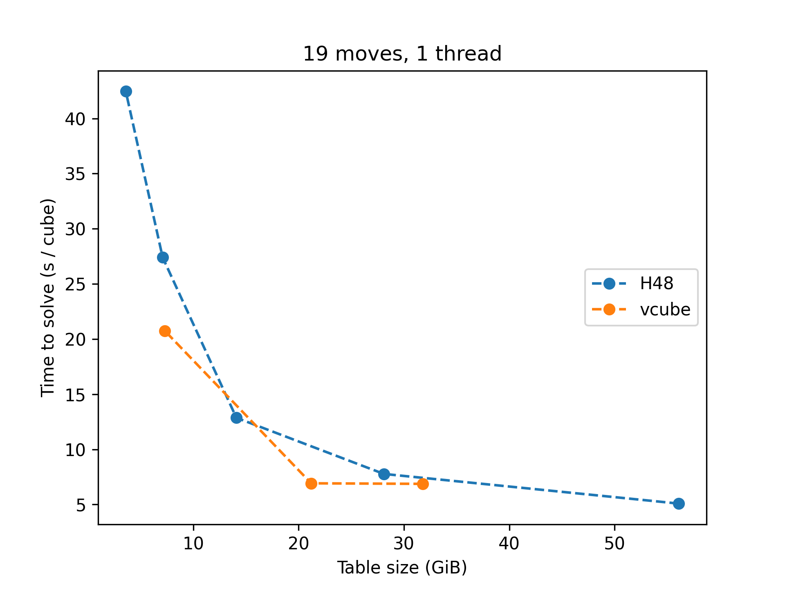

<!-- The following details block can be found in benchmarks/tables_1_thread.md -->

Results: Single solution, single thread

Time per cube (in seconds, lower is better).

|  Solver  |  Size  |17 moves|18 moves|19 moves|20 moves|Superflip|
|:---------|:-------|-------:|-------:|-------:|-------:|--------:|
|vcube 212 |58.2 GiB|    0.11|    0.75|    3.43|   27.28|    19.30|
|H48 h11   |56.5 GiB|    0.09|    0.50|    2.24|   15.73|    15.55|
|vcube 404 |31.8 GiB|    0.23|    1.24|    6.10|   59.33|   268.26|
|H48 h10   |28.3 GiB|    0.15|    0.76|    3.36|   23.51|    38.05|
|vcube 308 |21.2 GiB|    0.17|    1.02|    6.20|   58.70|   604.35|
|H48 h9    |14.1 GiB|    0.24|    1.48|    6.69|        |         |
|vcube 208 | 7.3 GiB|    0.56|    4.36|   20.58|        |         |
|H48 h8    | 7.1 GiB|    0.46|    3.36|   14.13|        |         |
|H48 h7    | 3.5 GiB|    0.63|    4.85|   23.25|        |         |
|vcube 112 | 2.4 GiB|    0.96|    9.29|   40.52|        |         |
|H48 h6    | 1.8 GiB|    1.25|    9.45|   46.31|        |         |

Time per cube adjusted for table size (in seconds \* GiB, lower is better).

|  Solver  |  Size  |17 moves|18 moves|19 moves|20 moves|Superflip|
|:---------|:-------|-------:|-------:|-------:|-------:|--------:|
|vcube 212 |58.2 GiB|    6.43|   43.80|  199.38| 1587.43|  1122.73|
|H48 h11   |56.5 GiB|    5.21|   28.28|  126.68|  889.01|   878.77|
|vcube 404 |31.8 GiB|    7.40|   39.47|  194.01| 1887.94|  8535.87|
|H48 h10   |28.3 GiB|    4.22|   21.37|   94.86|  664.22|  1075.08|
|vcube 308 |21.2 GiB|    3.51|   21.71|  131.50| 1245.26| 12819.94|
|H48 h9    |14.1 GiB|    3.34|   20.97|   94.57|        |         |
|vcube 208 | 7.3 GiB|    4.08|   31.74|  149.68|        |         |
|H48 h8    | 7.1 GiB|    3.25|   23.75|   99.82|        |         |
|H48 h7    | 3.5 GiB|    2.22|   17.12|   82.14|        |         |
|vcube 112 | 2.4 GiB|    2.33|   22.53|   98.23|        |         |
|H48 h6    | 1.8 GiB|    2.21|   16.70|   81.86|        |         |

