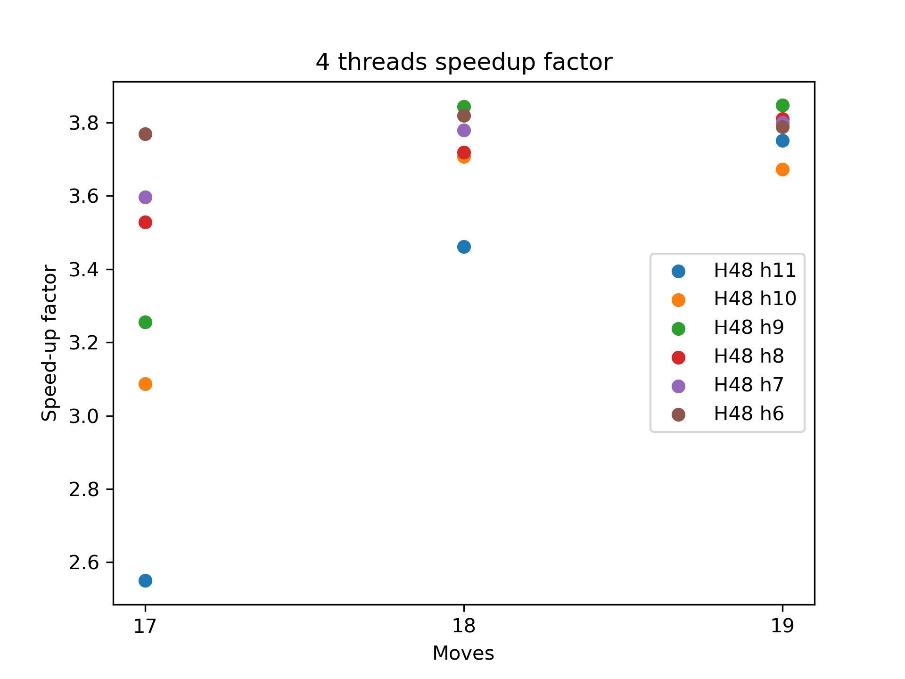

<!-- The following details block can be found in benchmarks/tables_4_threads.md -->

Results: Single solution, 4 threads

Time per cube (in seconds, lower is better).

|  Solver  |  Size  |17 moves|18 moves|19 moves|20 moves|Superflip|
|:---------|:-------|-------:|-------:|-------:|-------:|--------:|
|H48 h11   |56.5 GiB|    0.04|    0.14|    0.60|    3.97|     4.19|
|H48 h10   |28.3 GiB|    0.05|    0.20|    0.91|    6.65|     9.81|
|H48 h9    |14.1 GiB|    0.07|    0.39|    1.74|   12.54|    18.96|
|H48 h8    | 7.1 GiB|    0.13|    0.90|    3.71|        |         |
|H48 h7    | 3.5 GiB|    0.17|    1.28|    6.12|        |         |
|H48 h6    | 1.8 GiB|    0.33|    2.47|   12.22|        |         |

Speed-up factor (higher is better).

|  Solver  |  Size  |17 moves|18 moves|19 moves|20 moves|Superflip|
|:---------|:-------|-------:|-------:|-------:|-------:|--------:|
|H48 h11   |56.5 GiB|    2.55|    3.46|    3.75|    3.96|     3.71|
|H48 h10   |28.3 GiB|    3.09|    3.71|    3.67|    3.54|     3.88|
|H48 h9    |14.1 GiB|    3.25|    3.84|    3.85|        |         |
|H48 h8    | 7.1 GiB|    3.53|    3.72|    3.81|        |         |
|H48 h7    | 3.5 GiB|    3.60|    3.78|    3.80|        |         |
|H48 h6    | 1.8 GiB|    3.77|    3.82|    3.79|        |         |

